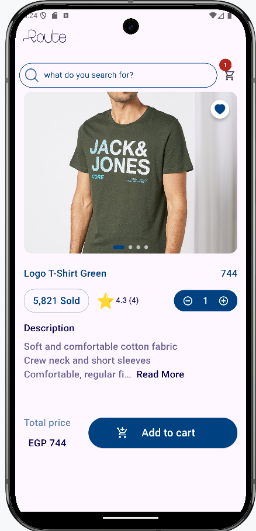

# 🛒 E-Commerce App - Flutter & Clean Architecture

A robust, full-featured E-Commerce mobile application built with **Flutter**. This project demonstrates advanced state management, professional architectural patterns, and seamless integration with RESTful APIs.

---

## 🚀 Core Features
* **Authentication:** User registration and secure login using **JWT (JSON Web Tokens)**.
* **Product Catalog:** Browse categories, view products with detailed descriptions, and high-quality image sliders.
* **Smart Shopping Cart:** * Add/Remove items with real-time total price calculation.
    * Update product quantities directly from the cart.
    * Persistent cart state synced with the backend.
* **Product Details:** Deep-dive into products with rating systems, quantity selectors, and image galleries.
* **Search & Filter:** Global search functionality to find products quickly across the app.
* **Responsive Layout:** Pixel-perfect UI designed for various screen sizes using `flutter_screenutil`.
* **User Profile:** View and update personal information (Name, Email, Phone) with local data persistence. 
* **Address Management:** Add and browse multiple shipping addresses with seamless API integration.

---

## 🛠 Technical Implementation
This application is engineered with a focus on **Clean Architecture** (Data, Domain, Presentation) to ensure the code is testable and maintainable.

* **State Management:** [Bloc/Cubit](https://pub.dev/packages/flutter_bloc) for efficient and predictable state handling.
* **Dependency Injection:** [GetIt](https://pub.dev/packages/get_it) & [Injectable] for modular service management.
* **Networking:** [Dio](https://pub.dev/packages/dio) with interceptors for API calls and error handling.
* **Navigation:** [AutoRoute](https://pub.dev/packages/auto_route) for declarative, strongly-typed routing.
* **Data Handling:** [Dartz](https://pub.dev/packages/dartz) for Functional Programming (Either Left/Right) error handling.
* **Design Patterns:** Implementation of Repository Pattern, Use Cases, and Data Sources for complete separation of concerns.
---

## 📸 App Preview

---